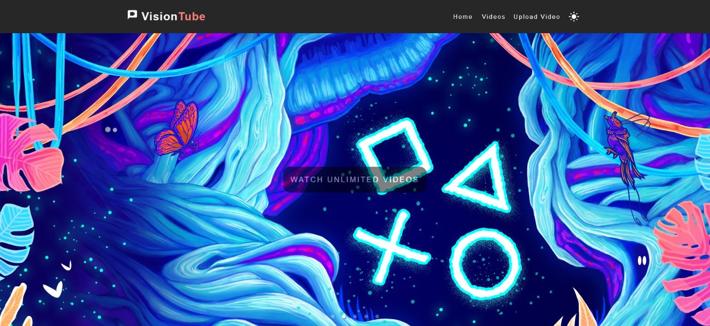

# VisionTube - A Video Streaming App

VisionTube is a modern and user-friendly video streaming app built using ReactJS and Material-UI. It allows users to discover and watch a wide range of videos in an intuitive and visually appealing interface. With seamless navigation, a responsive design, and interactive features, VisionTube provides an immersive video streaming experience.



## Features

- **Browse Videos**: Explore a diverse collection of videos across various categories, ensuring there's something for everyone.
- **Responsive Design**: VisionTube is designed to work flawlessly on different devices, from desktops to mobile phones.
- **Interactive Carousel**: Engage with a dynamic carousel that showcases featured videos or recent additions.
- **Search Functionality**: Easily find specific videos using the integrated search bar.
- **Video Player**: Enjoy a distraction-free viewing experience with the integrated video player.
- **React Router**: Seamlessly navigate through different pages of the app without page reloads.
- **Material-UI**: Aesthetic and consistent UI components provide a polished look and feel.
- **User-Friendly Interface**: Intuitive design ensures users can navigate and interact with the app effortlessly.

## Installation

1. Clone this repository to your local machine using:

   ```bash
   git clone https://github.com/KamalJoshi-web/visiontube.git
   ```

2. Navigate to the project directory:

   ```bash
   cd visiontube
   ```

3. Install the dependencies using:

   ```bash
   npm install
   ```

4. Run the development server:

   ```bash
   npm start
   ```

5. Open your browser and go to `http://localhost:3000` to access VisionTube.

## Dependencies

- ReactJS: A JavaScript library for building user interfaces.
- Material-UI: A popular React UI framework that provides pre-designed components for a consistent and modern design.
- React Router: A routing library for React applications, enabling navigation without full page reloads.
- Carousel: A library for creating interactive carousels or sliders in React.
- Other npm packages as required.

## Contributing

Contributions are welcome and encouraged! If you'd like to contribute to VisionTube, please follow these steps:

1. Fork the repository and create a new branch for your feature or bug fix.
2. Make your changes and ensure they work as intended.
3. Commit your changes and push them to your fork.
4. Create a pull request detailing your changes and their purpose.

## License

This project is licensed under the [MIT License](LICENSE).

---

Feel free to explore, use, and modify VisionTube according to your needs. If you encounter any issues or have suggestions for improvements, please don't hesitate to open an issue or contribute to the project. Happy streaming! 🎥🍿
